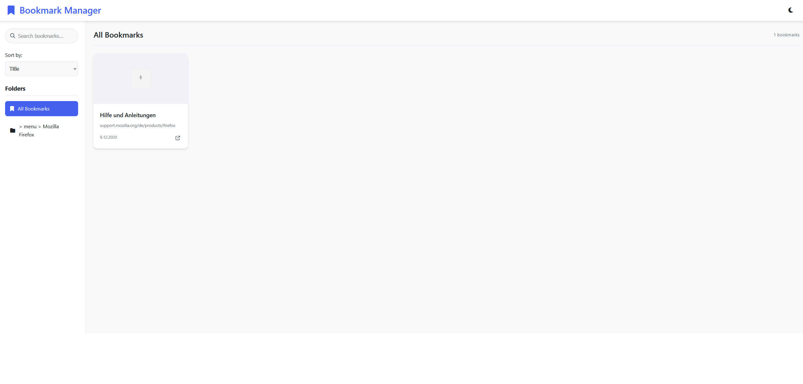

# Bookmark Manager

A beautiful, responsive web application for managing and organizing your bookmarks. Built with vanilla HTML, CSS, and JavaScript - no frameworks required!

## Features

- **Folder Navigation**: Organize bookmarks into folders with intuitive navigation
- **Smart Search**: Instantly search through bookmarks by title, URL, or description
- **Sorting Options**: Sort by date added, title, or URL
- **Dark Mode**: Toggle between light and dark themes
- **Responsive Design**: Works perfectly on desktop, tablet, and mobile devices
- **Fast Loading**: Optimized favicon loading with pre-validation to prevent flickering
- **Dynamic JSON Loading**: Automatically detects and loads bookmark JSON files
- **Pagination**: Navigate through large bookmark collections with ease

## Quick Start

### 1. Export Your Bookmarks

#### Firefox:
1. Open Firefox
2. Press `Ctrl+Shift+B` (Windows/Linux) or `Cmd+Shift+B` (Mac) to open Library
3. Click **Import and Backup** → **Export Bookmarks to HTML**
4. Save the file as `bookmarks.html` in the project folder
5. Convert HTML to JSON using the provided converter (see below)

#### Chrome:
1. Open Chrome
2. Go to `chrome://bookmarks/`
3. Click the three dots menu → **Export bookmarks**
4. Save as `bookmarks.html` and convert to JSON

### 2. Setup Your Bookmarks

The application automatically looks for bookmark files in the following order:
1. `bookmarks.json`
2. `bookmarks-*.json` (any file matching this pattern)
3. `bookmarks-2025-*.json` (dated bookmark files)
4. Falls back to sample data if no files found

### 3. Run the Application

Simply open `index.html` in your web browser - no server setup required!

## Project Structure

```
bookmark-manager/
├── index.html          # Main HTML file
├── styles.css          # Complete styling with dark mode support
├── script.js           # Core functionality and bookmark processing
├── bookmarks.json      # Your bookmark data (create this)
├── README.md           # This file
├── LICENSE             # MIT License
└── screenshots/        # Application screenshots
    ├── desktop-light.png
    ├── desktop-dark.png
    └── mobile-view.png
```

## Bookmark Data Format

Your JSON file should follow this structure:

```json
{
  "guid": "root________",
  "title": "",
  "index": 0,
  "dateAdded": 0,
  "lastModified": 0,
  "id": 1,
  "typeCode": 2,
  "type": "text/x-moz-place-container",
  "root": "placesRoot",
  "children": [
    {
      "guid": "toolbar_____",
      "title": "Bookmarks Toolbar",
      "index": 0,
      "dateAdded": 0,
      "lastModified": 0,
      "id": 2,
      "typeCode": 2,
      "type": "text/x-moz-place-container",
      "root": "toolbarFolder",
      "children": [
        {
          "guid": "example123",
          "title": "Example Website",
          "index": 0,
          "dateAdded": 1625097600000000,
          "lastModified": 1625097600000000,
          "id": 3,
          "typeCode": 1,
          "type": "text/x-moz-place",
          "uri": "https://example.com",
          "iconUri": "https://example.com/favicon.ico"
        }
      ]
    }
  ]
}
```

## HTML to JSON Converter

If you have bookmarks in HTML format, you can use this simple converter:

1. Open `index.html`
2. The application will prompt you to upload your HTML file
3. It will automatically convert and save as JSON

## Customization

### Colors
Edit the CSS variables in `styles.css` to match your brand:

```css
:root {
  --primary-color: #4361ee;
  --secondary-color: #3f37c9;
  --accent-color: #4895ef;
  --background-color: #f8f9fa;
  --card-background: #ffffff;
}
```

### Layout
- Adjust grid columns in `.bookmarks-grid`
- Modify card dimensions in `.bookmark-card`
- Change sidebar width with `--sidebar-width`

## Screenshots

### Desktop Light Mode


### Desktop Dark Mode


### Mobile View


## Troubleshooting

### Bookmarks Not Loading
1. Check that your JSON file is valid using [JSONLint](https://jsonlint.com/)
2. Ensure the file is in the same directory as `index.html`
3. Check browser console for error messages

### Favicons Not Showing
1. Some websites block favicon access - this is normal
2. The app uses Google's favicon service as fallback
3. Check if favicon URLs are accessible in your browser

### Performance Issues
1. For large bookmark collections (>1000 items), consider splitting into multiple files
2. Use pagination to improve loading times
3. Clear browser cache if experiencing issues

## Contributing

Contributions are welcome! Please feel free to submit a Pull Request. For major changes, please open an issue first to discuss what you would like to change.

## License

This project is licensed under the MIT License - see the [LICENSE](LICENSE) file for details.

## Acknowledgments

- Icons from [Font Awesome](https://fontawesome.com/)
- Favicon service provided by Google
- Inspired by modern bookmark managers

## Support

If you encounter any issues or have questions:
1. Check the [Issues](https://github.com/yourusername/bookmark-manager/issues) page
2. Create a new issue with detailed description
3. Include browser version and operating system information

---